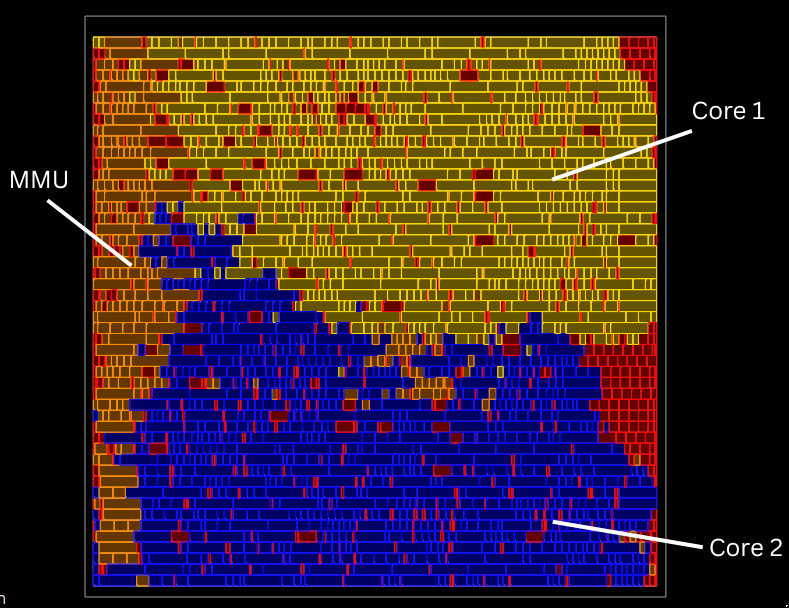
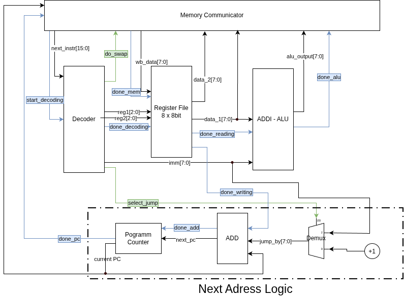

# HeiChips 2026 -- N.A.N.D. (Not A Nand Device)
## A minimalist dualcore CPU with MMU and DMA support
Two custom CPU cores and a custom memory management unit (MMU) in just 200µm x 200µm with a maximum clock frequency of 303MHz. Almost entirely engineered in just two days at the  HeiChips 2026 Summer School.

## Top Level Architecture
The two cores use the MMU for all memory interactions, including fetching of instructions. The MMU ensures that instructions and data are transferred to the correct core and implements a custom communication protocol with the eFPGA. The eFPGA allows the CPUs to interface with the on-chip SRAM or (in the future) with other projects. 

## ISA
| Instruction     | Description                                        |
|-----------------|----------------------------------------------------|
| ADDI Ra Rb #imm | Jump to PC + #imm if, and only if, R = 0           |
| JMPZ R #imm     | Rb = Ra + #imm                                     |
| SWAP Ra Rb      | Swap Ra with value at address saved in Rb (atomic) |

More info on the ISA can be found .

And an exemplary assembly program can be found .

## CPU Architecture

The Memory Communicator module interfaces with the MMU and thus is partly responsible for memory access.

## MMU

The MMU takes load and swap requests from the CPUs and perfroms the necessary communication with the eFPGA through a custom communication protocol. Additionally, the MMU arbits memory access in case of parallel request from the CPUs. 

The interface of the MMU is as follows:
| Port         | Description                                                 | Dimension (C = #CPUs) |
|--------------|-------------------------------------------------------------|-----------------------|
| `clk_i`        | clock                                                       | 1                     |
| `rst_ni`       | reset (active low)                                          | 1                     |
| `reg_data`     | data input from CPUs                                        | Cx8                   |
| `ram_addr`     | address input from CPUs                                     | Cx8                   |
| `valid`        | signals from CPUs to request memory operation               | C                     |
| `do_swap`      | set if and only if CPUs want to perform a swap              | C                     |
| `mem_done`     | signals to the CPUs that the memory operation was completed | C                     |
| `data_out_cpu` | data output to CPUs                                         | 16                    |
| `fpga_in1`     | lower significance bits input from eFPGA                    | 8                     |
| `fpga_in2`     | higher significance bits input from eFPGA                   | 8                     |
| `fpga_out`     | output to eFPGA                                             | 8                     |

Communication between a CPU and the MMU taks place as follows:

1. Setting `valid` requests a memory transfer. `ram_addr`, and `ram_data` if a swap operation is requested, must be set to the. desired values when `valid` is set. If a swap is requested, `do_swap` must also be set when `valid` is set. `valid` must be kept set until the transfer finishes. `ram_addr`, `ram_data`and `do_swap` must not be changed until the transfer finishes.
2. `mem_done` signals to the CPU that the transfer has finished and that the data at `data_out_cpu` is valid. This state is only kept for one cycle. 
3. The CPU acknowledges the finished transfer to the MMU by resetting `valid`.

Communication between the MMU and the eFPGA takes place as follows:

1. The MMU sends `8'b0000_00x1` over `fpga_out` to the eFPGA. `x`is set when a swap is requested and reset when a load is requested. 
2. The MMU send the desired address over `fpga_out`.
3. The MMU waits for the finish of the read operation by waiting until the two LSBs of `fpga_in` are <em>not</em> `2'b11` (Note that this implies that the eFPGA must always set the two LSBs of `fpga_in1` to `2'b11`.). Because these two bits are at the position of the opcode, and `2'b11` is not a valid opcode, they can be used to signal a valid instruction. If a swap is performed, only `fpga_in2` is used for the data. 
4. If no swap was requested, go to 6. If a swap was requested, the MMU sends the to be written data over `fpga_out`. Note that since a swap operation is performed, the address from the read operation is also valid for the write operation. 
5. The eFPGA signals the finish of the write operation by setting `fpga_in1` different from `2'b11`.
6. The MMU waits for the recieving CPU to acknowledge before starting the next interaction. 
